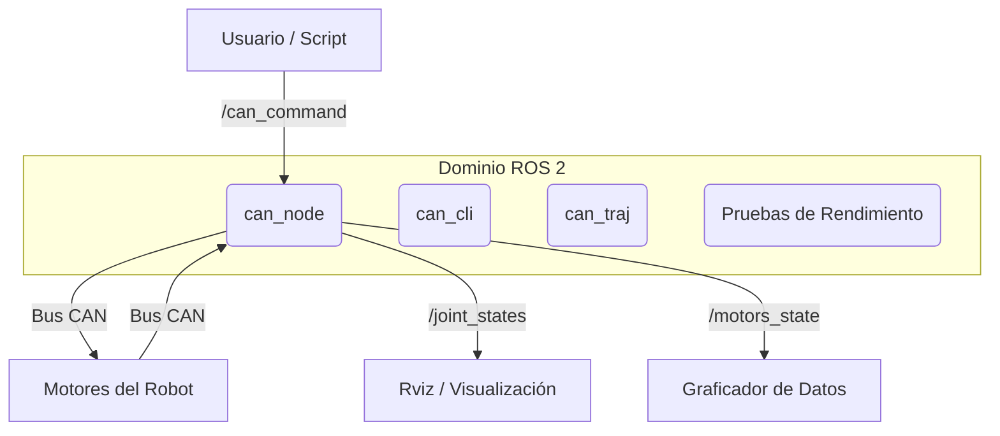

# Arquitectura de Software

## 🧩 Grafo de Nodos

## 📡 Protocolo CAN

El sistema utiliza un protocolo personalizado sobre tramas CAN.

### IDs de Mensaje

El ID CAN se compone de un **Prefijo** (Acción) y un **Sufijo** (ID del Motor).
`ID = (Prefijo << 4) | IDMotor`

| Prefijo | Hex | Acción | Formato del Payload |
| :--- | :--- | :--- | :--- |
| **A** | `0xA0` | **Solicitud Info** | Vacío |
| **B** | `0xB0` | **Feedback** | `float32 pos, float32 vel` (8 bytes) |
| **C** | `0xC0` | **Setpoint** | Varía (ver abajo) |
| **D** | `0xD0` | **Config/Modo** | `float32 valor` |

### Formatos de Setpoint (Prefijo C)

*   **Articulaciones Rotacionales (J1-J4)**:
    *   Payload: `[float32 Posición, float32 Velocidad]`
    *   Unidad: Radianes, Radianes/seg
*   **Articulación Lineal (J5)**:
    *   Payload: `[float32 Posición]`
    *   Unidad: Milímetros
*   **Gripper (J6)**:
    *   Payload: `[uint8 PWM]`
    *   Rango: 0-255

## 📨 Tópicos ROS 2

### Suscritos
*   **`/can_command`** (`std_msgs/msg/String`)
    *   Formato: `"<Acción><Motor>:<Payload>"`
    *   Ejemplos:
        *   `"C1:1.57,0.5"` (Mover J1 a 1.57 rad a 0.5 rad/s)
        *   `"C5:100.0"` (Mover J5 a 100 mm)
        *   `"A1"` (Solicitar info de J1)

### Publicados
*   **`/joint_states`** (`sensor_msgs/msg/JointState`)
    *   Mensaje estándar de ROS para visualización del robot.
*   **`/motors_state`** (`std_msgs/msg/Float32MultiArray`)
    *   Array plano: `[p1, p2, p3, p4, p5, v1, v2, v3, v4, v5]`
