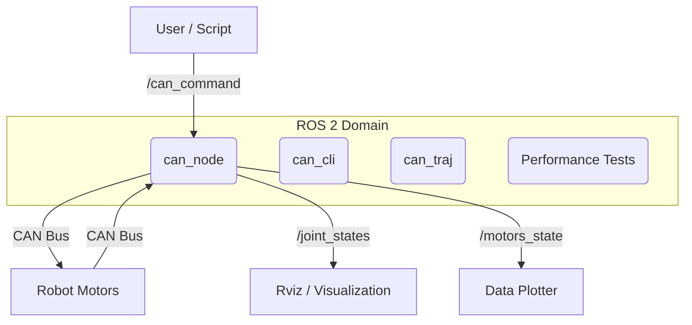

# Software Architecture

## 🧩 Node Graph

## 📡 CAN Protocol

The system uses a custom protocol over CAN frames.

### Message IDs

The CAN ID is composed of a **Prefix** (Action) and a **Suffix** (Motor ID).
`ID = (Prefix << 4) | MotorID`

| Prefix | Hex | Action | Payload Format |
| :--- | :--- | :--- | :--- |
| **A** | `0xA0` | **Info Request** | Empty |
| **B** | `0xB0` | **Feedback** | `float32 pos, float32 vel` (8 bytes) |
| **C** | `0xC0` | **Setpoint** | Varies (see below) |
| **D** | `0xD0` | **Config/Mode** | `float32 value` |

### Setpoint Formats (Prefix C)

*   **Rotational Joints (J1-J4)**:
    *   Payload: `[float32 Position, float32 Velocity]`
    *   Unit: Radians, Radians/sec
*   **Linear Joint (J5)**:
    *   Payload: `[float32 Position]`
    *   Unit: Millimeters
*   **Gripper (J6)**:
    *   Payload: `[uint8 PWM]`
    *   Range: 0-255

## 📨 ROS 2 Topics

### Subscribed
*   **`/can_command`** (`std_msgs/msg/String`)
    *   Format: `"<Action><Motor>:<Payload>"`
    *   Examples:
        *   `"C1:1.57,0.5"` (Move J1 to 1.57 rad at 0.5 rad/s)
        *   `"C5:100.0"` (Move J5 to 100 mm)
        *   `"A1"` (Request info from J1)

### Published
*   **`/joint_states`** (`sensor_msgs/msg/JointState`)
    *   Standard ROS message for robot visualization.
*   **`/motors_state`** (`std_msgs/msg/Float32MultiArray`)
    *   Flat array: `[p1, p2, p3, p4, p5, v1, v2, v3, v4, v5]`
