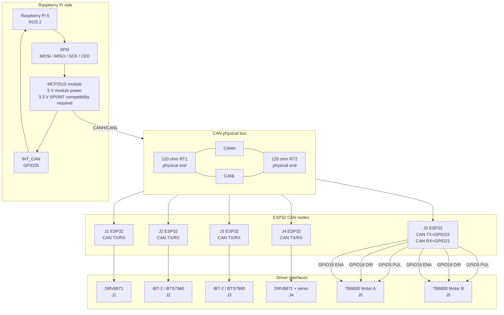

<!-- SPDX-License-Identifier: CC-BY-4.0 -->

# Electronics and CAN architecture figure draft

Draft Mermaid diagram for the electronics/CAN figure in the HardwareX manuscript.

## Manuscript caption draft

**Figure X. Electronics and CAN communication architecture.** The Raspberry Pi 5 communicates with the distributed ESP32 motor-control nodes through an MCP2515 CAN-SPI interface. The CAN bus uses CANH/CANL differential signaling with 120-ohm terminations at the intended physical ends of the bus. The J5 elevator node distributes the same PUL, DIR and ENA signals to two TB6600 drivers for synchronized dual-motor elevator motion.

## Open items before final figure export

- Confirm physical positions of RT1 and RT2.
- Confirm CANH/CANL orientation in every branch connector.
- Confirm exact MCP2515 module model and 3.3 V SPI/INT compatibility.
- Confirm exact connector types, pin order and wire colors when the robot is available.
