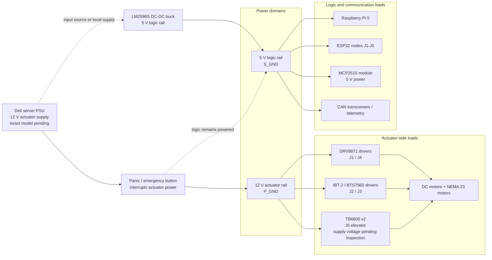

<!-- SPDX-License-Identifier: CC-BY-4.0 -->

# Power distribution figure draft

Draft Mermaid diagram for the HardwareX power-distribution figure.

## Manuscript caption draft

**Figure X. Power-distribution architecture.** The current design separates actuator-side power from the 5 V logic domain. The panic/emergency button is intended to interrupt actuator power while keeping the Raspberry Pi, ESP32 nodes and CAN/telemetry electronics powered for diagnostics. The final TB6600 driver supply voltage and physical grounding/bonding details must be confirmed during the next robot access session.

## Open items before final figure export

- Confirm exact Dell PSU model.
- Confirm supply voltage used by both J5 TB6600 drivers.
- Confirm final `P_GND` / `S_GND` bonding or isolation detail.
- Photograph panic-button wiring path.
- Measure 5 V rail before final logic connection documentation.
