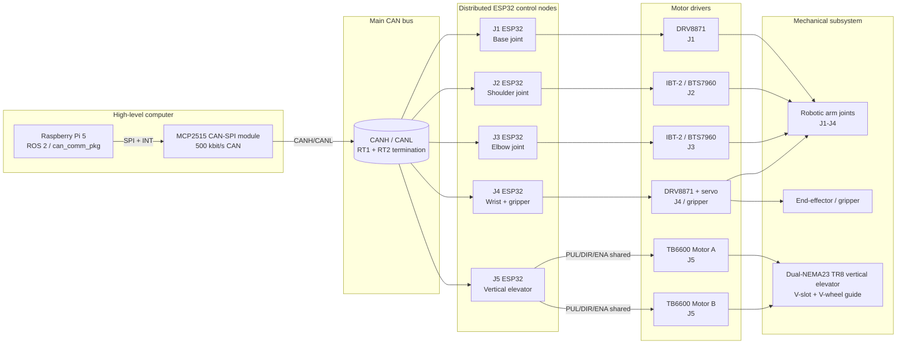

<!-- SPDX-License-Identifier: CC-BY-4.0 -->

# System architecture figure draft

Draft Mermaid diagram for the HardwareX manuscript. This figure describes the current open-source package scope: Raspberry Pi 5, ROS 2, CAN bus, distributed ESP32 nodes, motor drivers and the vertical elevator/mechanical subsystem.

## Manuscript caption draft

**Figure X. System architecture of the Assistbelle arm and vertical elevator subsystem.** A Raspberry Pi 5 runs ROS 2 and interfaces with the CAN network through an MCP2515 CAN-SPI module. Distributed ESP32 nodes receive CAN commands and control joint-level motor drivers. The J5 elevator node drives two TB6600 stepper drivers in parallel using shared PUL/DIR/ENA signals to synchronize two NEMA 23 motors.

## Notes before final figure export

- Replace this Mermaid draft with a vector SVG/PDF figure before final submission if required.
- Keep the J5 `B5` CAN payload compatibility note in the text until firmware/ROS is finalized.
- Add physical photos or CAD render callouts when the final release is frozen.
